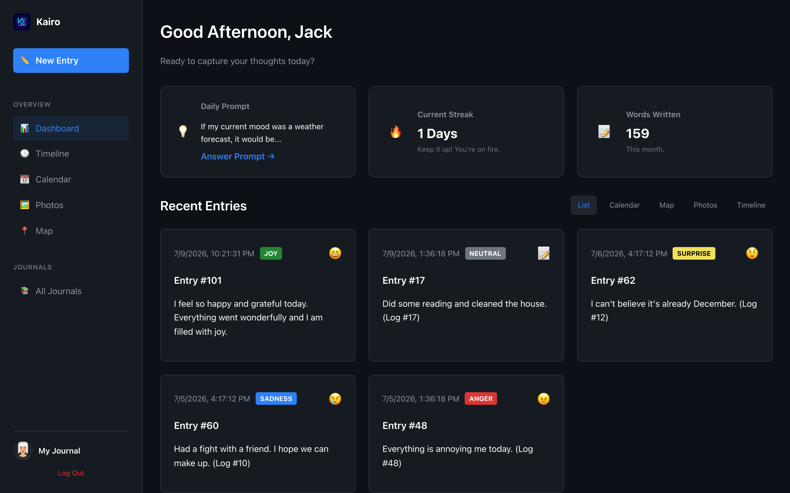
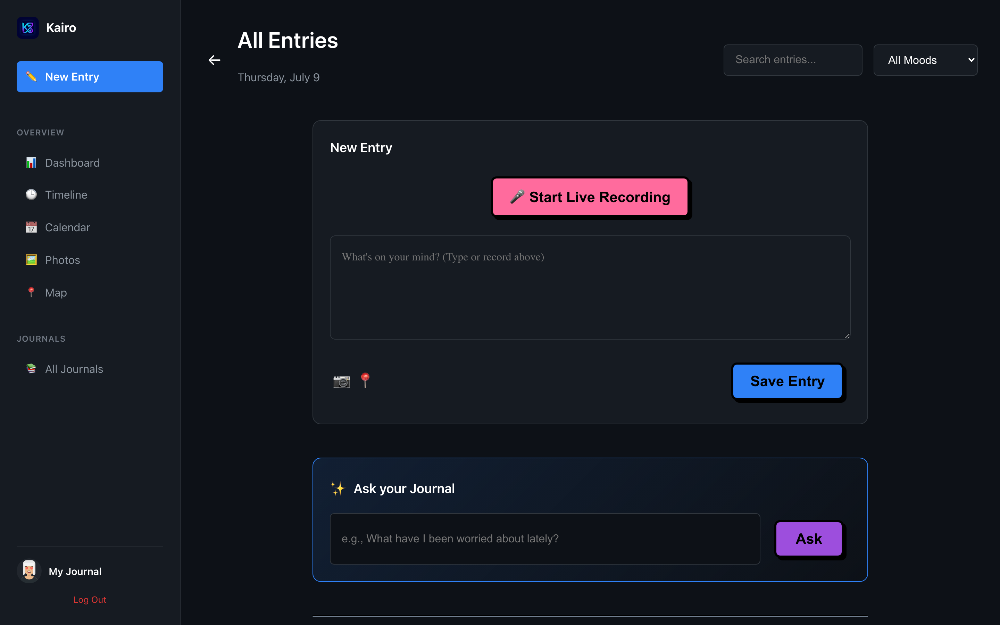
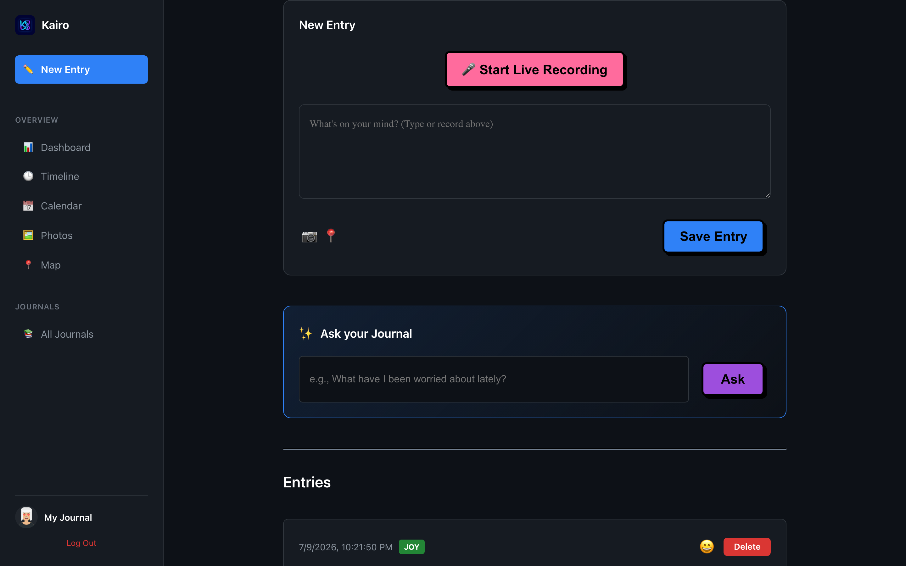
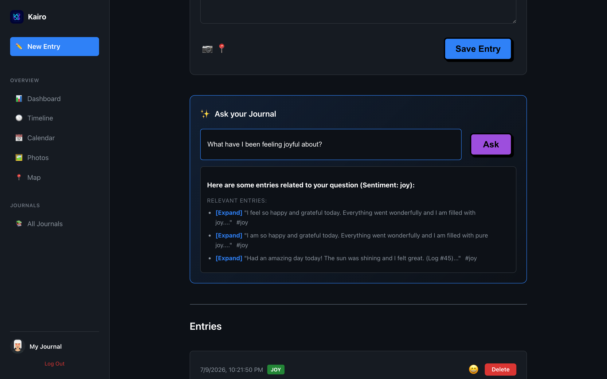
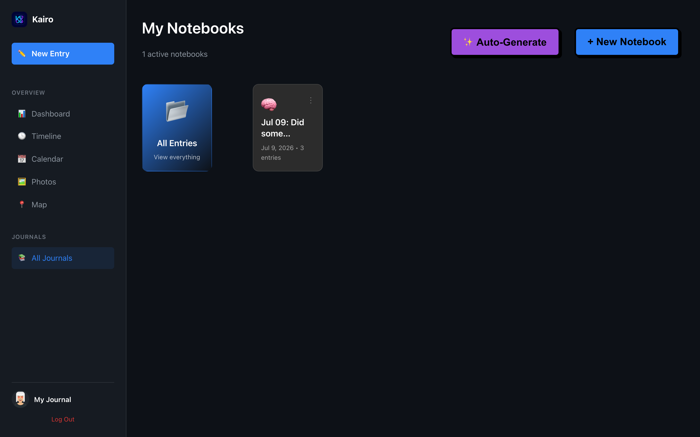

# Kairo

A private, voice-first journal with a hosted history viewer and local-only AI.

[Watch Demo](#demo) · [How the AI works](#how-the-ai-works) · [Run locally](#run-locally) · [Release notes](RELEASE_NOTES.md)

<p align="center">
  
</p>

**What Kairo does in one breath:**

- Record a reflection and get an automatic transcription (Whisper).
- Detect emotions and surface patterns across your entries.
- Ask natural-language questions about past entries (local retrieval + Gemma).

---

## Demo

> **Video coming next.** A clean 60–90 second screen recording is the best proof that voice + AI actually work. Until then, use the gallery below and run the app locally.

<!-- When ready, replace this block:
[](https://youtu.be/YOUR_VIDEO_ID)
or Loom: https://www.loom.com/share/YOUR_ID
-->

**Suggested demo script (60–90s):**

1. One-line intro: *“Kairo is a voice-first AI journal.”*
2. Record a short spoken entry.
3. Show transcription + emotion label.
4. Ask a chat question about past entries.
5. Show retrieved context from earlier journals.
6. Close on dashboard or auto-generated notebooks.

**For your resume while not deployed:** `Kairo — GitHub | Video Demo` (not “Live Demo”).

---

## What Kairo does

Kairo is built for quick capture and long-term reflection:

| You do this | Kairo does this |
| --- | --- |
| Speak a thought | Transcribes audio with Distil-Whisper |
| Save an entry | Classifies emotion (joy, sadness, anger, fear, …) |
| Ask “When was I stressed about work?” | Retrieves similar entries locally and answers with Gemma |
| Want structure | Groups entries into notebooks (manual or auto-generated) |
| Browse memory | Dashboard, timeline, calendar, map, and photo views |

Also supported: image uploads, location on entries, Google or email login, and text + sentiment search.

---

## Product story (screenshots)

The story recruiters should see without running anything:

> **Record → transcribe → feel the emotion → search patterns or chat with past entries.**

| Step | Screen | Status |
| --- | --- | --- |
| 1. Start | Sign-in | ✅ `docs/images/auth-page.png` |
| 2. Home | Dashboard | ⏳ add `docs/images/dashboard.png` |
| 3. Capture | Voice recorder | ⏳ add `docs/images/voice-recording.png` |
| 4. Result | Entry + emotion tag | ⏳ add `docs/images/entry-with-emotion.png` |
| 5. History | Journal list / filters | ⏳ add `docs/images/entry-history.png` |
| 6. Chat | RAG chat answer + context | ⏳ add `docs/images/chat-rag.png` |
| 7. Organize | Notebook library / auto-notebooks | ⏳ add `docs/images/notebooks.png` |

### Gallery

#### Sign-in


#### Dashboard

<!--  -->
*Placeholder — capture the main dashboard after login (greeting, stats, recent entries).*

#### Voice recording

<!--  -->
*Placeholder — show the recorder mid-capture or the “recording…” state.*

#### Transcription + emotion

<!--  -->
*Placeholder — a saved entry with transcribed text and the emotion badge.*

#### Entry history

<!--  -->
*Placeholder — journal list with search / sentiment filters.*

#### Chat with your journal (RAG)

<!--  -->
*Placeholder — a natural-language question and retrieved past entries as context.*

#### Notebooks

<!--  -->
*Placeholder — library of notebooks, including auto-generated ones.*

> **Tip:** Drop 4–6 PNGs into `docs/images/` with the names above. No need for every corner of the UI — just the story arc.

---

## How the AI works

Kairo now has two explicit runtimes:

```text
Hosted or local browser
        │
        ├── HTTPS → Kairo Cloud API
        │           Authentication, entries, notebooks, photos, sync
        │           No PyTorch, MLX, model weights, or AI endpoints
        │
        └── loopback → Kairo Local AI (127.0.0.1:8001)
                    Distil-Whisper transcription
                    ModernBERT text emotions
                    W2V-BERT vocal-emotion signal
                    Qwen3 semantic retrieval
                    Gemma 4 grounded journal answers
```

Raw voice recordings go only to the loopback service. A saved voice entry
synchronizes its transcript and derived labels, not the audio file. Typed
entries still save if local analysis is unavailable.

| Stage | Model / tool | Role |
| --- | --- | --- |
| Speech → text | Distil-Whisper Large v3.5 | Higher-accuracy English ASR on Apple MPS |
| Text emotion | ModernBERT GoEmotions | 28 detailed emotions plus a compatible broad mood |
| Vocal signal | W2V-BERT Emotion | Secondary, uncertainty-aware signal from speech |
| Embeddings | Qwen3 Embedding 0.6B | 1024-dimensional, instruction-aware retrieval |
| Journal answer | Gemma 4 E2B 4-bit | Local grounded response over retrieved entries |

The model manager keeps only one set of weights resident at a time. Entry
vectors are cached in memory, but every retrieval request contains only the
signed-in user's entries, eliminating the old cross-user global index.

---

## Technical decisions & challenges

A few choices that shaped the project:

- **Voice-first, not text-first.** The primary path is record → transcribe → save, so friction stays low when you only have a moment to speak.
- **Emotion as a first-class field.** Kairo stores a broad mood for filters,
  the detailed text-emotion label, top scores, and (for recordings) a separate
  vocal signal.
- **User-scoped local retrieval.** Journal history is embedded locally from the
  signed-in user's entries so “questions about me” are grounded in that
  person's writing without a shared vector index.
- **Deployable viewer, local AI.** `main.py` has no ML imports. Hosted builds can
  view and edit journal data while `local_ai.py` remains bound to loopback.
- **SQLite by default.** One-command local demo without standing up Postgres; `DATABASE_URL` still allows PostgreSQL when you need it.
- **Editorial React UI.** Dashboard, timeline, calendar, map, and photos treat memory as something you *browse*, not only a search box.

**Privacy boundary:** raw audio and inference stay local. Journal text, images,
and locally derived labels are currently stored by the configured cloud API.
End-to-end encryption of journal content is a separate future layer and is not
claimed by this version.

---

## Tech stack

### Backend

- **FastAPI** + **SQLAlchemy**
- **SQLite** locally · PostgreSQL-compatible via `DATABASE_URL`
- Model-free cloud API in `main.py`
- Authenticated loopback AI API in `local_ai.py`
- **Transformers** — Whisper and emotion classification
- **Sentence Transformers** — Qwen retrieval
- **MLX** — Gemma generation on Apple silicon
- **librosa** / **FFmpeg** — local audio decode and resampling
- JWT auth, optional **Google OAuth**

### Frontend

- **React 19** + **TypeScript**
- **Vite**
- **Vitest** + Testing Library
- **Axios**
- **Anime.js**
- **Leaflet** / React Leaflet
- **React Calendar**

---

## Run locally

### Requirements

- Python 3.13
- Node.js 20.19+ and npm
- FFmpeg (for audio)
- Apple silicon for the current Gemma MLX runtime
- Optional: PostgreSQL if you prefer it over SQLite

### 1. Local dependencies

```bash
uv python install 3.13
uv venv --python 3.13 .venv
uv pip install --python .venv/bin/python -r requirements-ai.txt
```

For a hosted API that never installs ML packages, install only
`requirements.txt`.

### 2. Download the free local models

Download all five model groups (about 10 GB total):

```bash
./.venv/bin/python download_models.py
```

To download only selected capabilities:

```bash
./.venv/bin/python download_models.py transcription text-emotion
```

The default model directory is
`~/Library/Application Support/Kairo/models` on macOS and
`~/.cache/kairo/models` elsewhere. Set `KAIRO_MODELS_DIR` to use another
location. The downloader is safe to rerun and resumes Hugging Face downloads.

### 3. Environment variables

Project root `.env` (see also `.env.example`):

```env
DATABASE_URL=sqlite:///./kairo.db
SECRET_KEY=dev-secret-key
ALGORITHM=HS256
ACCESS_TOKEN_EXPIRE_MINUTES=30
GOOGLE_CLIENT_ID=your-client-id.apps.googleusercontent.com
```

Frontend `kairo-frontend/.env` (see `.env.example`):

```env
VITE_API_URL=http://127.0.0.1:8000
VITE_AI_MODE=disabled
VITE_LOCAL_AI_URL=http://127.0.0.1:8001
VITE_GOOGLE_CLIENT_ID=your-client-id.apps.googleusercontent.com
```

`start-kairo.sh` overrides `VITE_AI_MODE` for the local session and generates
an ephemeral token shared only by the local browser build and loopback service.
Do not put a local AI token in a hosted frontend build.

### Google sign-in (optional)

The `401: invalid_client` page means the configured client ID is a placeholder,
was deleted, or does not belong to a current Google OAuth client. Create or
recover a **Web application** client in [Google Auth Platform](https://console.cloud.google.com/auth/clients), then add both local origins:

```text
http://localhost:3000
http://127.0.0.1:3000
```

Use the same client ID (the value ending in `.apps.googleusercontent.com`) in
both files:

```env
# .env
GOOGLE_CLIENT_ID=your-client-id.apps.googleusercontent.com

# kairo-frontend/.env
VITE_GOOGLE_CLIENT_ID=your-client-id.apps.googleusercontent.com
```

Restart Kairo after changing either file. The browser client ID is public, so
it is safe to put this one value in both tracked `.env.example` files and
commit them. The `kairo` launcher copies those templates into `.env` files for
new clones automatically, letting local clones share the same Google sign-in.
Never add a Google client secret to the repository.

For a deployed site, add its exact `https://` origin to the same Google client.
Forks deployed to a different domain need their own client ID (or an origin you
explicitly add); Google does not allow a wildcard origin for arbitrary forks.
Set that same deployed UI origin in `CORS_ALLOWED_ORIGINS` in the backend `.env`
so Kairo's API accepts its browser requests.

### 4. Seed demo data

To create the original disposable demo account and reset its sample database:

```bash
source .venv/bin/activate
rm -f kairo.db
python seed_data.py
```

Demo login:

| Field | Value |
| --- | --- |
| Email | `jack.tucker@example.com` |
| Password | `password123` |

To safely add or refresh showcase content for an existing account without
changing its password or deleting any of its data:

```bash
./.venv/bin/python seed_showcase_data.py \
  --email enmanueldelossantos64@gmail.com
```

The showcase seed is limited to the local SQLite database, is disabled when
`KAIRO_ENV=production`, reuses matching notebooks, and skips or refreshes its
own deterministic entries when run again.

### 5. Frontend dependencies

```bash
cd kairo-frontend
npm ci
```

### 6. Start Kairo Local

The launcher starts all three processes: storage API, local AI companion, and
the Vite UI.

```bash
./start-kairo.sh
```

The local AI service is bound to `127.0.0.1`; it is not exposed to the LAN.

### Manual startup

**Cloud-safe API**:

```bash
source .venv/bin/activate
uvicorn main:app --host 127.0.0.1 --port 8000
```

**Local AI companion**:

```bash
export KAIRO_LOCAL_AI_TOKEN="$(openssl rand -hex 32)"
export VITE_LOCAL_AI_TOKEN="$KAIRO_LOCAL_AI_TOKEN"
export VITE_AI_MODE=local
uvicorn local_ai:app --host 127.0.0.1 --port 8001
```

**UI** (`kairo-frontend`, inheriting the two `VITE_` variables):

```bash
npm run dev
```

- Frontend: [http://localhost:3000](http://localhost:3000)
- Storage API: [http://127.0.0.1:8000](http://127.0.0.1:8000)
- Local AI: [http://127.0.0.1:8001](http://127.0.0.1:8001)

### Hosted viewer

Deploy `main:app` with `requirements.txt`, a PostgreSQL `DATABASE_URL`, a strong
`SECRET_KEY`, and the hosted UI origin in `CORS_ALLOWED_ORIGINS`. Build the
frontend with:

```env
VITE_API_URL=https://your-api.example.com
VITE_AI_MODE=disabled
```

The resulting site can authenticate, view, create, edit, organize, and sync
entries. AI buttons explain that Kairo Local is required. Filesystem uploads
are suitable for the local demo; a multi-instance deployment should replace
them with object storage.

---

## Project structure

| Path | Role |
| --- | --- |
| `main.py` | Model-free storage/auth/notebook API |
| `local_ai.py` | Authenticated loopback AI API |
| `local_ai_models.py` | Lazy model manager and inference pipeline |
| `download_models.py` | Repeatable free-model downloader |
| `migrations.py` | Additive schema migration for local-AI metadata |
| `models.py` | SQLAlchemy models |
| `schemas.py` | Pydantic request/response schemas |
| `auth.py` | JWT helpers |
| `utils.py` | Password hashing |
| `seed_data.py` | Demo user + sample entries |
| `seed_showcase_data.py` | Idempotent, account-scoped showcase content |
| `kairo-frontend/` | React UI |
| `docs/images/` | README screenshots |

---

## Limitations & next steps

**Today**

- Hosted viewer and local AI are separated at the process and dependency level.
- Chat is retrieval-grounded and generated locally by Gemma.
- Raw audio remains on the device; synchronized journal text is not yet
  end-to-end encrypted.

**Next (high leverage for recruiters)**

1. Add the 4–6 product screenshots listed above (`docs/images/`).
2. Record and link a **60–90s** unlisted YouTube or Loom demo (voice path is the proof).
3. Optional: thin public deploy or Docker compose for “clone and try.”
4. Add an end-to-end encrypted journal-content layer for hosted storage.

---

Built as a voice-first journaling system with real ML in the loop — not just a CRUD app with a microphone button.
